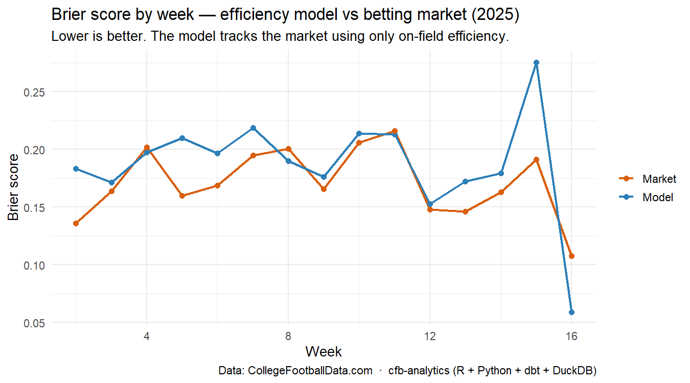
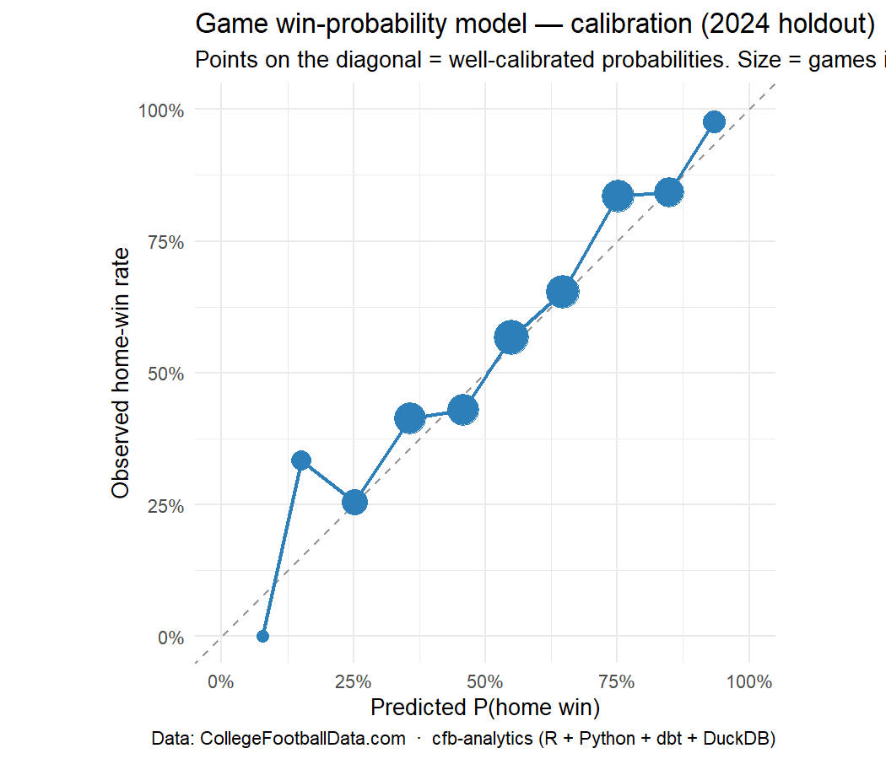
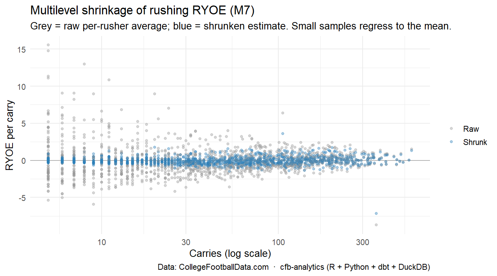

# cfb-analytics — Polyglot College-Football Analytics Pipeline

A portfolio project that ingests **Division-I college football** data from the
[CollegeFootballData (CFBD) API](https://collegefootballdata.com), lands it in **DuckDB**,
transforms it with **dbt** (medallion → Kimball star, incl. an SCD2 dimension), implements the
statistical models from *Football Analytics with Python & R* (Eager & Erickson) in **both R and
Python**, and renders a **Quarto dashboard** that evaluates the data and the models' accuracy.

**Stack:** R (`cfbfastR`, `tidyverse`, `tidymodels`, `lme4`, `gt`, `cfbplotR`) ·
Python (`uv`, `dbt-duckdb`, `statsmodels`, `scikit-learn`) · DuckDB · dbt · Quarto.
Orchestrated by a Python CLI that runs the R models as subprocess steps — **the data
(DuckDB tables + a metrics JSON) is the contract between languages**, not in-memory objects.

> **Status:** pipeline live end-to-end for 2023–24 FBS. Medallion + Kimball star build green
> (112 dbt tests, SCD2 `dim_team` capturing the 2024 realignment); the book models **M1–M7** and
> the game win-probability model run in **R and Python** with a committed **R↔Python parity** gate
> (coefficients agree to tolerance; PCA/cluster/mixed-effects agree label-invariantly); the Quarto
> dashboard renders. See [`PROJECT_PLAN.md`](PROJECT_PLAN.md) for the full design and phased plan.
> Next: play-level EPA + optional M8 scraping, then polish (Phase 5–6).

## Dashboard preview

The game win-probability model, trained on 2023 and evaluated on the **sealed 2024 holdout**,
approaches the betting market using only on-field efficiency — **Brier 0.195, AUC 0.76, 70%
accuracy** vs a home-field-naive baseline (0.243) and the market line (0.183).




Multilevel shrinkage (M7) then applies the book's regression-to-the-mean lesson — raw rushing
efficiency is mostly noise (ICC ≈ 1%), so small-sample rushers are pooled toward the league mean:



## Modeling (grounded in the book)

| # | Method (book ch.) | CFB application |
|---|---|---|
| M1 | EDA + metric stability (Ch 2) | Which efficiency stats are skill vs noise |
| M2/M3 | Simple → multiple linear regression (Ch 3–4) | **Rushing Yards Over Expected (RYOE)** |
| M4 | Logistic GLM + odds ratios (Ch 5) | **Completion % Over Expected (CPOE)** |
| M5 | Poisson regression (Ch 6) | Passing-TD counts → betting-prop framing |
| M6 | PCA + clustering (Ch 8) | Team/player archetypes |
| M7 | Multilevel / mixed-effects (Ch 9) | Shrinkage / regression-to-the-mean |
| M8 | Web scraping (Ch 7, optional) | Recruiting rank vs on-field production |

Each method is implemented in **R and Python**, with an R↔Python parity check surfaced on the
dashboard. A game-level **win-probability / spread** model consumes these features and is
benchmarked against the CFBD betting line.

## Data source & terms (§9 pre-flight)

- **Source:** CollegeFootballData.com API (v2). **Attribution shown** in this README and on the
  dashboard: *Data: [CollegeFootballData.com](https://collegefootballdata.com)*.
- **Auth:** a **free** API key is required (register at
  [collegefootballdata.com/key](https://collegefootballdata.com/key)), sent as an
  `Authorization: Bearer <key>` header. The key is read from the `CFBD_API_KEY` environment
  variable (`.env` / `.Renviron`) and is **never committed**.
- **Rate limits:** free tier = **1,000 API calls/month**; Cloudflare blocks bursty parallel
  requests. Ingestion is therefore **bounded, throttled, and cached** — a season already in
  bronze is never re-pulled.
- **Redistribution:** raw data is **gitignored**; only code, aggregates, and an attributed
  screenshot are committed. The dashboard HTML (which embeds data) is gitignored.
- **Verdict: GO-WITH-CONDITIONS** — non-commercial portfolio use, attributed, bounded
  on-demand collection (no perpetual poller). Confirm the current Terms at key registration.

## Quickstart

> Requires the runtime toolchain (R, `uv`, dbt, Quarto, DuckDB) — see `PROJECT_PLAN.md` Phase 0.

```bash
# 1. Python env
uv sync
# 2. R env
Rscript -e 'renv::restore()'
# 3. set your key (do NOT commit)
cp .env.example .env   # then edit CFBD_API_KEY
# 4. run the pipeline end-to-end
uv run python run.py --season 2024
```

The pipeline also runs as individual stages (each a subprocess; a non-zero exit aborts the run):

```bash
uv run python run.py ingest     # CFBD  -> data/bronze/*.csv   (quota-aware, cached; needs a key)
uv run python run.py land       # bronze CSVs -> DuckDB bronze.*
uv run python run.py build      # dbt: staging -> SCD2 snapshot -> silver -> gold (+ tests)
uv run python run.py export     # gold/silver -> data/gold/*.csv model feeds
uv run python run.py models     # book models M1-M7 + game model, in R
uv run python run.py parity     # Python parity fits + load_results (R<->Python parity GATE)
uv run python run.py dashboard  # prepare feeds, render Quarto -> docs/, refresh preview PNGs
```

## Case study — engineering & modeling decisions

The point of this repo is craft, not just a result. The decisions that shaped it:

**The polyglot contract: files, not a bridge.** R and Python never share memory — they exchange
data only through the DuckDB warehouse and flat CSVs (R writes `data/bronze` and `data/results`;
Python owns all DuckDB/Parquet I/O and writes `data/gold` feeds). This was a deliberate rejection
of `rpy2`/`reticulate`: an in-process bridge is fragile in CI and couples the languages' lifecycles.
The payoff is that killing any stage fails the pipeline cleanly, and the same discipline shaped the
**dashboard** — Python (pre-render) reads DuckDB and hands R/knitr flat files, so even the report
honors the contract rather than smuggling a bridge back in.

**Every method is built twice, and that's a test.** M1–M7 and the game model are each implemented
in R *and* Python on the identical feed. Because the fits are mathematically the same (OLS, IRLS
GLM, Poisson, logistic MLE), their coefficients *must* agree — so `load_results` **fails the build**
if any term diverges beyond tolerance (currently 23/23 agree; unsupervised/mixed-effects methods
are checked label-invariantly — PC correlation, cluster ARI, BLUP correlation). This gate earned its
keep: it immediately flagged a **perfect-collinearity bug** in the game model (`net_epa_diff =
off_epa_diff − def_epa_diff`), where R's `glm` silently dropped a term while `sklearn` split the
coefficient arbitrarily. Same predictions, divergent coefficients — invisible without the parity check.

**Data-quality war stories.** Real feeds fight back:
- *No usable play key.* `cfbfastR` rounds its 18-digit `id_play` to a float upstream, collapsing
  531k plays onto 266k distinct values. Fix: type it `BIGINT` on load (stops further loss) and
  **mint a deterministic surrogate** `play_key = hash(game_id, game_play_number, intra-seq)` after
  removing exact-duplicate rows.
- *An FBS warehouse over an all-divisions feed.* Games/plays arrive for every division, so 77% of
  team-game rows had no matching FBS team. Fix: a Kimball **"Non-FBS" placeholder** dimension member
  + `COALESCE`, and the star is scoped to FBS-touching games.
- *Silent non-determinism.* The rolling-form windows ordered by `week` alone, so a team with two
  games in one week produced order-dependent "entering" features. Fix: a `(week, game_id)` tiebreaker;
  the feed is now byte-identical across rebuilds.

**SCD2 that captures real history.** `dim_team` is a dbt snapshot **replayed one season at a time**
(the orchestrator resets and loops seasons), so the 2024 conference realignment — Texas/Oklahoma to
the SEC, the Pac-12's collapse — is versioned history with season-range validity, not a static lookup.

**Honest modeling over flattering numbers.** The bar for the game model is the **betting market**,
not accuracy: on the sealed 2024 holdout it reaches **Brier 0.195 / AUC 0.76 / 70%** using only
on-field efficiency — crushing a home-field-naive baseline (0.243) and *approaching* the market
(0.183) without beating it, which is the honest expected result. M1 found rushing efficiency is
noisy; M7's mixed-effects **ICC of ~1.2%** quantifies exactly that (almost all RYOE variance is
play-to-play noise), which is *why* the shrinkage is so aggressive. And I **chose not to rebuild a
from-scratch expected-points model**: it would duplicate the warehouse's already-calibrated EPA, and
next-score labels reconstructed from the available start-of-play scores validate at only ~91% vs the
final scores — shipping a worse model to pad the method list would be the wrong call.

**What it demonstrates:** end-to-end ELT (API → medallion → Kimball star), analytics-engineering
rigor (grain declarations, SCD2, freshness/volume tests, idempotency), a real ML workflow (leakage-
safe time-aware validation, sealed holdout, beat-a-baseline, calibration), and genuine polyglot
range — R, Python, and SQL each doing what they're best at, cross-checked against each other.

## Roadmap

Done: ingestion → medallion → Kimball star + SCD2 → book models M1–M7 (R + Python) → game
win-probability model → Quarto dashboard. Deferred but pre-structured: optional **M8** recruiting-vs-
production scrape (needs its own source terms review), GitHub Actions **CI** (lint + `dbt build`),
and a **BigQuery** push of the gold tables. See [`PROJECT_PLAN.md`](PROJECT_PLAN.md) for the full plan.
