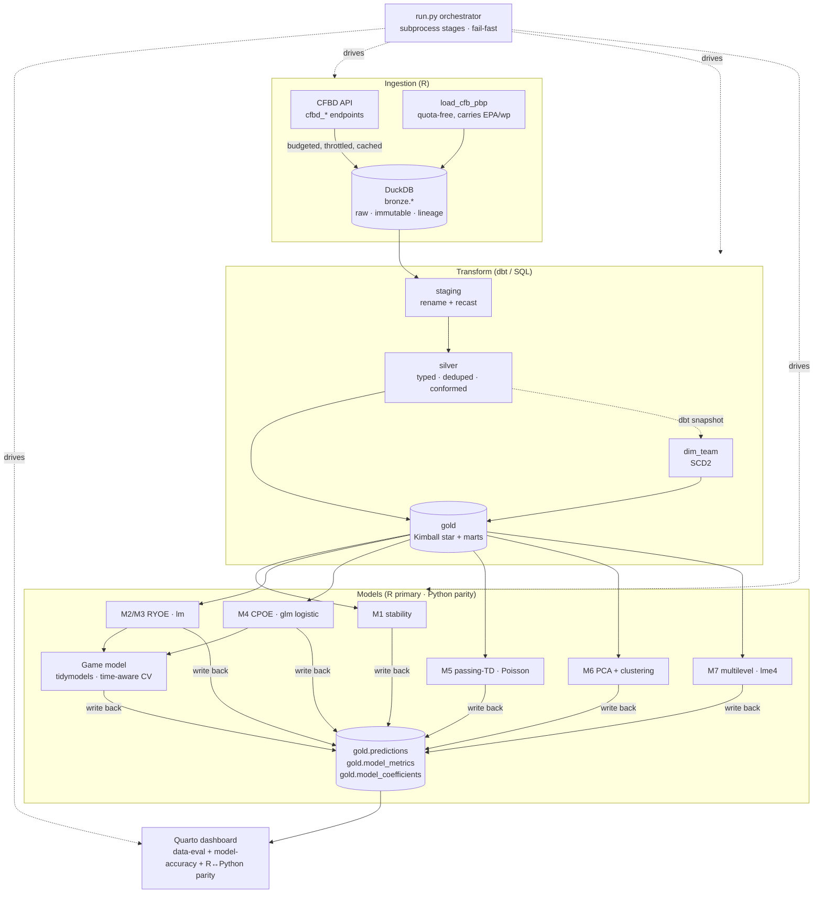

# Architecture

**Polyglot contract:** R and Python exchange data **only** through the DuckDB warehouse
(`gold.*` tables + `artifacts/metrics.json`) — never in-memory. Killing the R stage fails the
pipeline cleanly.
